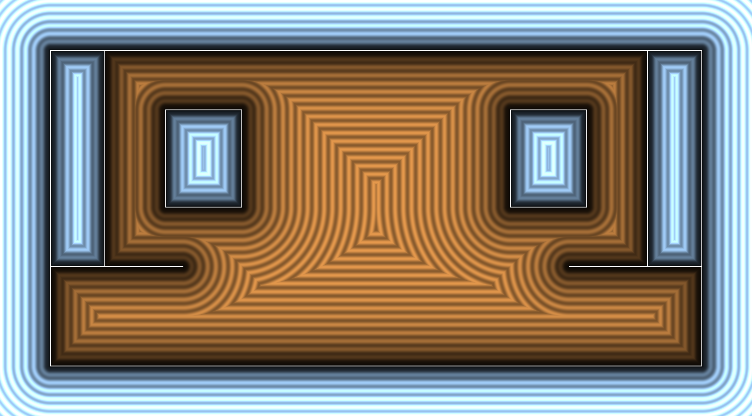
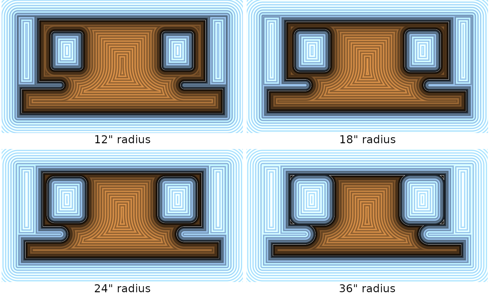

# 2023 FRC Field Signed Distance Function

Based primarily on [6328's FieldConstants.java](https://github.com/Mechanical-Advantage/RobotCode2023/blob/main/src/main/java/org/littletonrobotics/frc2023/FieldConstants.java).

We've added a function to get the minimum distance from a point to any of the field boundaries including
- The Grids
- The Charging Station
- The Guardrail between the Loading Station and Community
- The Field Perimeter

Additionally, you may model your robot as a circle and find the SDF of the configuration space

